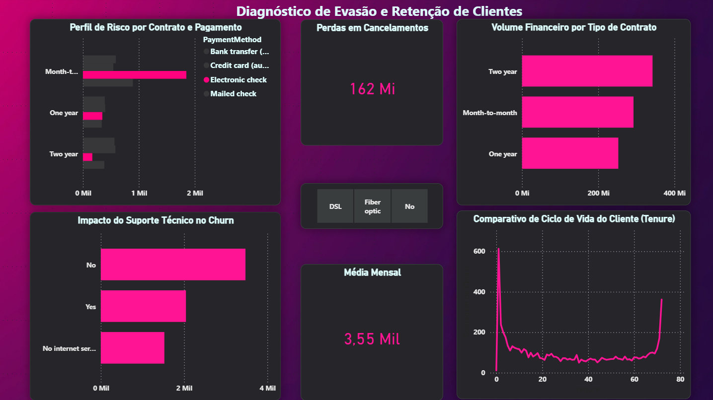

**TODOS OS INSIGHTS AQUI FORAM COLETADOS DE UM PROJETO CRIADO POR MIM**

## 📊 Insights do Dashboard

A partir desse Dashboard, fica notório que a grande parcela de cancelamentos acontece devido ao método de pagamento via **boleto eletrônico**. Ao alterar alguns filtros e analisar as estatísticas, concluí que os dois métodos que mais agregam renda e estabilidade para a empresa são: **Credit Card (Cartão de Crédito)** e **Bank Transfer (Transferência Bancária)**.

De acordo com isso, eu adotaria uma política de bonificação para incentivar a transferência do método de pagamento de boleto bancário para os dois citados anteriormente. Essas bonificações poderiam ser descontos de 10%, extensão de contratos de streaming/linhas, ou parcerias com outras plataformas.

Observa-se que, além do boleto bancário, há outro problema: **o contrato de mês a mês (Month-to-month)**. A taxa de cancelamento em contratos curtos é extremamente maior do que nas opções contratuais de um e dois anos. É necessário tomar medidas para resolver isso, como, por exemplo, oferecer descontos nas assinaturas de maiores intervalos de tempo ou embutir melhores produtos e benefícios nesses contratos mais longos.

🛠 **Parte Técnica:** Para visualizar o processo de limpeza de dados com Python (Pandas), tratamento de nulos e os scripts de nuvem AWS que geraram a base para esta análise, acesse:
[Repositório do Projeto Churn](https://github.com/Mattustk/Projeto-churn)

---

## 🥇 Insights da Camada Gold
*Insights gerados a partir do tratamento final dos dados (Feature Gold).*

### 📅 DataFrame: Fidelidade e Contratos

| | Contract | Churn | Total_Clientes | Media_Mensalidade | Faturamento_Total | Media_Meses_Fidelidade |
| :--- | :--- | :--- | :---: | :---: | :---: | :---: |
| 0 | **Month-to-month** | No | 2220 | 61.46 | 3.378.679,25 | 21.03 |
| 1 | **Month-to-month** | **Yes** | **1655** | **73.02** | **1.927.182,25** | **14.02** |
| 2 | **One year** | No | 1306 | 62.54 | 3.792.062,30 | 41.71 |
| 3 | **One year** | Yes | 166 | 85.05 | 674.991,20 | 44.96 |
| 4 | **Two year** | No | 1637 | 60.11 | 6.022.500,25 | 56.95 |
| 5 | **Two year** | Yes | 48 | 86.78 | 260.753,45 | 61.27 |

Como citado anteriormente, um dos maiores motivos dessa taxa de cancelamento está nos contratos **Month-to-month**. Observa-se que há **1.655 clientes** que cancelaram SOMENTE nesses contratos; isso representa **88% do total** de clientes perdidos. É uma necessidade de extrema urgência transformar esse modelo contratual, tornando os planos anuais mais abrangentes e atrativos para o público.

### 🌐 DataFrame: Serviço de Internet

| | InternetService | Churn | Total_Clientes | Media_Mensalidade |
| :--- | :--- | :--- | :---: | :---: |
| 0 | DSL | No | 1957 | 60.20 |
| 1 | DSL | Yes | 459 | 49.08 |
| 2 | **Fiber optic** | No | 1799 | 93.93 |
| 3 | **Fiber optic** | **Yes** | **1297** | **88.13** |
| 4 | No | No | 1407 | 21.13 |
| 5 | No | Yes | 113 | 20.37 |

Aqui está mais um problema oculto, e o principal deles: quem apenas olha o dashboard superficialmente não consegue perceber que a **Fibra Óptica**, por mais lucrativa que seja, também é uma **faca de dois gumes**. 

Basta analisar as suas perdas: por mais que a fibra seja o serviço mais rentável da empresa, ela sozinha conseguiu causar um prejuízo de mais de **R$ 142 milhões** ao total — mais de **85% de toda a receita perdida** pelo cancelamento da companhia. Isso acontece devido à falta de suporte e atendimento técnico aos consumidores que utilizam a fibra óptica.

### 💳 DataFrame: Métodos de Pagamento

| | PaymentMethod | Churn | Total_Clientes | Media_Mensalidade | Faturamento_Total |
| :--- | :--- | :--- | :---: | :---: | :---: |
| 0 | Bank transfer (automatic) | No | 1286 | 65.05 | 4.749.117,10 |
| 1 | Bank transfer (automatic) | Yes | 258 | 77.73 | 643.141,60 |
| 2 | Credit card (automatic) | No | 1290 | 64.56 | 4.664.814,90 |
| 3 | Credit card (automatic) | Yes | 232 | 77.36 | 533.155,95 |
| 4 | **Electronic check** | No | 1294 | 74.23 | 3.551.488,55 |
| 5 | **Electronic check** | **Yes** | **1071** | **78.70** | **2.333.134,80** |
| 6 | Mailed check | No | 1304 | 41.40 | 1.411.332,60 |
| 7 | Mailed check | Yes | 308 | 54.56 | 165.748,35 |

Outro problema grave, como analisado no dashboard, é o **boleto bancário**. Olhando a tabela de pagamentos, o *Electronic check (Boleto)* é o que mais gera dinheiro bruto, mas também é, disparado, o que mais perde. 

É bizarro: enquanto no Cartão de Crédito a gente perdeu cerca de **232 clientes**, no boleto nós tivemos um prejuízo de **1.071 cancelamentos**. Isso causou um rombo de mais de **R$ 2,3 milhões** que simplesmente sumiram do faturamento.

---

### 🏁 Conclusões Finais

A análise revela um padrão crítico: o cliente contrata o serviço de Fibra Óptica via Boleto Bancário sob um modelo de assinatura *Month-to-month* (mensal). Quando esse serviço apresenta qualquer defeito técnico, a empresa falha em oferecer o suporte necessário.

Como o contrato é curto (sem fidelidade) e o pagamento exige uma ação manual do cliente (emissão e pagamento do boleto), ele possui total liberdade — e incentivo — para cancelar o plano imediatamente ao enfrentar o primeiro problema. Resolver o suporte técnico da fibra e incentivar a transição para pagamentos automáticos são os passos definitivos para estancar essa perda milionária.
